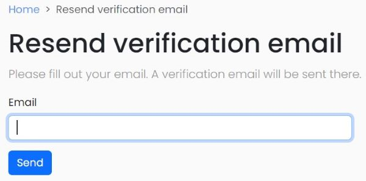

# portalium-site

<p>

<h1 align="center">Yii Email Verify</h1>

This module allows you to create a new user and enables an existing user to log in.
- Login and signup.
- Getting currently logged in identity.
- Active-passive user control
- E-mail verification
- Resending the verification email
- E-mail confirmation settings

## Requirements

-PHP 7.4 or higher

## Installation
The package could be installed with composer :<br/>
1.Open the composer.json file of your root project.<br/>
2.Add the link of the module to the repositories section 
```shell
https://github.com/portalium/yii2-site.git 
```
3.Include the module in your current project in the require section.<br/>

After performing these steps, you can add the module to your project via Composer by going to the directory where your project is located in the terminal and running the composer update command.


## General usage

#### Login
The login method checks whether the mail control settings are enabled after verifying the user information.

```php
if ($this->validate())
{
 if($user->status===User::STATUS_ACTIVE)
 {
 
 }else
 {
 
 }
} else {

 }
```
### E-mail verification
The actionVerifyEmail method is a function that performs the email verification process for the user and does so using a token.
```php
public function actionVerifyEmail($token)
```
### Resend Verification Email
This method provides users with a way to resend verification emails when needed.
```php
if ($model->load(Yii::$app->request->post()) && $model->validate()) {
if ($model->sendEmail()) {
Yii::$app->session->setFlash('success', 'Check your email for further instructions.');
return $this->goHome();
}
Yii::$app->session->setFlash('error', 'Sorry, we are unable to resend verification email for the provided email address.');
}
```


### Email Confirmation settings
It inserts a setting named 'Email Confirmation' into a database table associated with the 'site' module. This setting is displayed in the user interface using a radio button. The 'Email Confirmation' option can be set as 'Active' or 'Passive', and based on this selection, the value '1' or '0' is saved to the database.<br/>


### Verify Email Form

#### __construct :
A constructor method includes a class's constructor. The constructor method is automatically called when an object of the class is created and is used to perform specific initializations.
This constructor method ensures the proper initialization of the class by verifying the validity of the email verification code and checking if the corresponding user exists in the database. In this way, the class is securely and correctly utilized for the email verification process.

#### verifyEmail :
The purpose of this method is to complete the user's email verification process and activate their account. If the verification process is successful, it returns the activated user model. If it fails, it returns a null value.
```php
public function verifyEmail()
{
$user = $this->_user;
$user->status = User::STATUS_ACTIVE;
return $user->save(false) ? $user : null;
}
```
### Code Contributors

This project exists thanks to all the people who contribute.


## Package development

Once you have created your package, you can create the components, controllers, models, database migrations, and views within the package.

Here are some links with more information about components, controllers, models, database migrations, and views:

- [Creating a component](https://www.yiiframework.com/doc/guide/2.0/en/concept-components)
- [Creating a controller](https://www.yiiframework.com/doc/guide/2.0/en/structure-controllers)
- [Creating a model](https://www.yiiframework.com/doc/guide/2.0/en/structure-models)
- [Creating a database migration](https://www.yiiframework.com/doc/guide/2.0/en/db-migrations)
- [Creating a view](https://www.yiiframework.com/doc/guide/2.0/en/structure-views)

## License
The Portalium  is free software. It is released under the terms of the BSD License.
Please see [`LICENSE`](./LICENSE.md) for more information.

Maintained by [Portalium Software](https://www.yiiframework.com/).

## Follow updates
[](https://www.linkedin.com/company/diginova-informatics/)